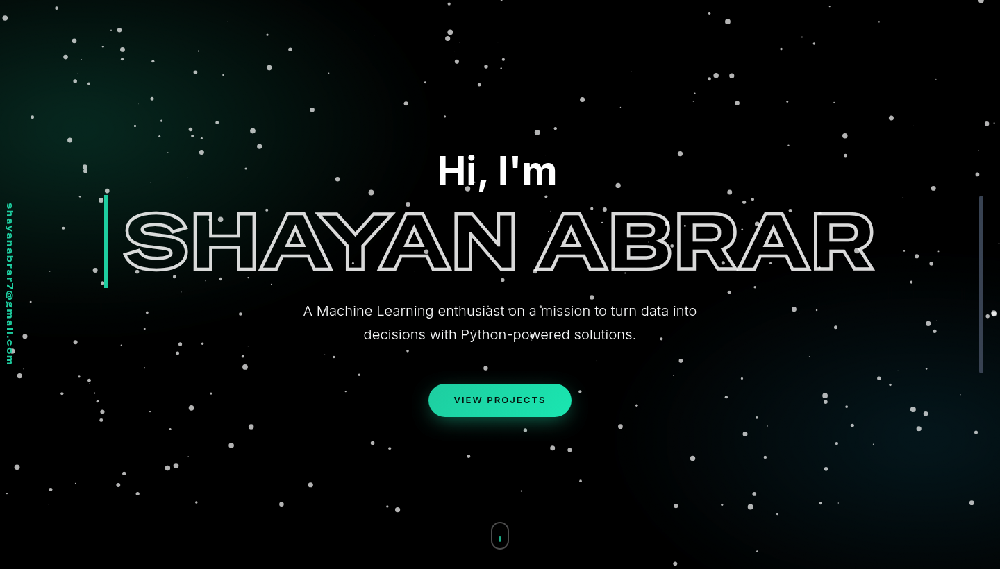

<div align="center">

# ✦ Shayan Abrar — Portfolio

**Python &amp; Machine Learning Developer · Junior AI Engineer**
Turning data into decisions with Python-powered, AI-driven solutions.

[](https://shayan-abrar.vercel.app/)
[](https://github.com/SHAYAN-ABRAR)
[](https://www.linkedin.com/in/shayan-abrar/)

<br/>



</div>

---

## ✦ Overview

A fast, fully responsive personal portfolio with a **dark glassmorphism** aesthetic and a mint
accent (`#1DCD9F`). It's a single-page experience built with vanilla HTML, CSS and JavaScript —
no framework — and elevated with a custom motion layer: an animated cursor, 3D tilt cards,
cursor-tracking spotlights, magnetic buttons and scroll-reveal animations.

---

## ✦ Features

- 🎨 **Dark glassmorphism UI** — cohesive mint accent, soft shadows, frosted cards
- 🖱️ **Custom animated cursor** — a dot with a lagging ring that reacts to interactive elements
- 🪄 **3D tilt + spotlight cards** — project cards tilt and glow toward the cursor
- 🧲 **Magnetic buttons** — primary buttons gravitate toward the pointer
- 🌌 **Animated hero** — drifting aurora glow over an interactive particle field
- 🔢 **Animated GitHub stats** — live repos / stars / followers / commits that count up
- 🧬 **Scroll-reveal** — headings and cards animate in, with gradient accent bars
- 🎞️ **Film-grain overlay** for a premium, filmic texture
- 🕸️ **Animated journey timeline** and a categorized, interactive tech stack
- 📨 **Working contact form** — Formspree-powered with smart anti-gibberish validation
- 🐙 **GitHub API integration** — live activity with a graceful, on-brand fallback
- ♿ **Accessible & considerate** — `:focus-visible` rings, `prefers-reduced-motion`, keyboard-friendly
- 📱 **Responsive** across mobile, tablet and desktop

---

## ✦ Tech Stack


| Layer | Tools |
|---|---|
| **Markup & layout** | HTML5, Tailwind CSS (CDN), Bootstrap 5 |
| **Styling & motion** | Custom CSS design system, GSAP + ScrollTrigger, particles.js |
| **Interactions** | Vanilla JS (custom cursor, tilt, spotlight, magnetic, counters) |
| **Typography** | Sora, Inter & Special Gothic Expanded One (Google Fonts) |
| **Integrations** | GitHub REST API, Formspree |
| **Icons** | Devicon, Font Awesome, Simple Icons |

---

## ✦ Sections

`Hero` · `About` · `Journey (timeline)` · `Tech Stack` · `GitHub Activity` · `Projects` · `Contact`

---

## ✦ Project Structure

```
Shayan-Portfolio-Website/
├── index.html      # Markup & content for every section
├── styles.css      # Design system, glassmorphism & motion layer
├── script.js       # Loader, particles, GSAP reveals, GitHub API, contact form
├── enhance.js      # Custom cursor, tilt, spotlight, magnetic buttons, counters
├── assets/         # Images, icons, résumé & preview
└── README.md
```

---

## ✦ Run Locally

```bash
# 1. Clone
git clone https://github.com/SHAYAN-ABRAR/Shayan-Portfolio-Website.git
cd Shayan-Portfolio-Website

# 2. Serve (any static server works)
python -m http.server 8000
#    then open http://localhost:8000
```

> No build step required — it's a static site.

### Customize

- **Content** → edit the sections in `index.html`
- **Accent color** → tweak the `--accent` variable in `styles.css`
- **GitHub feed** → set your `username` in `script.js`
- **Contact form** → set your Formspree endpoint in `script.js`

---

## ✦ Connect

- 🌐 **Website** — [shayan-abrar.vercel.app](https://shayan-abrar.vercel.app/)
- 💼 **LinkedIn** — [shayan-abrar](https://www.linkedin.com/in/shayan-abrar/)
- 🐙 **GitHub** — [SHAYAN-ABRAR](https://github.com/SHAYAN-ABRAR)
- ✉️ **Email** — [shayanabrar7@gmail.com](mailto:shayanabrar7@gmail.com)
- 📍 **Location** — Dhaka, Bangladesh

---

## ✦ Acknowledgements

Built on the shoulders of [GSAP](https://gsap.com/), [particles.js](https://vincentgarreau.com/particles.js/),
[Tailwind CSS](https://tailwindcss.com/), [Bootstrap](https://getbootstrap.com/),
[Devicon](https://devicon.dev/) and [Font Awesome](https://fontawesome.com/).

---

<div align="center">

Made with 💚 by <b>Shayan Abrar</b>

</div>
